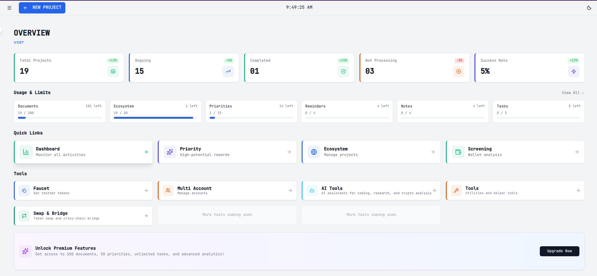
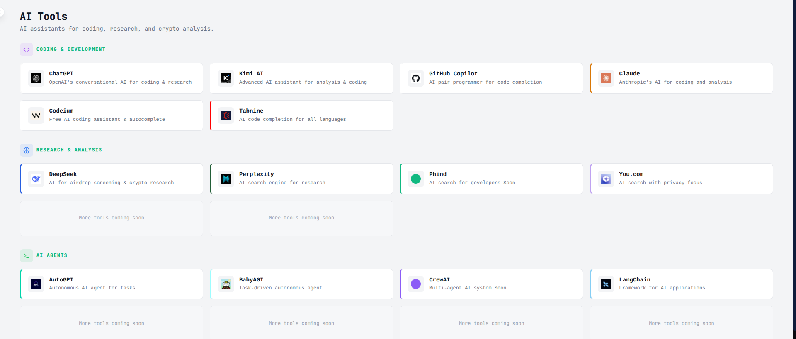
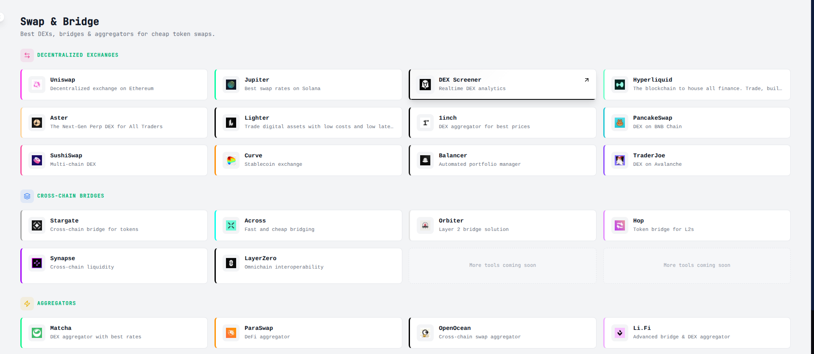
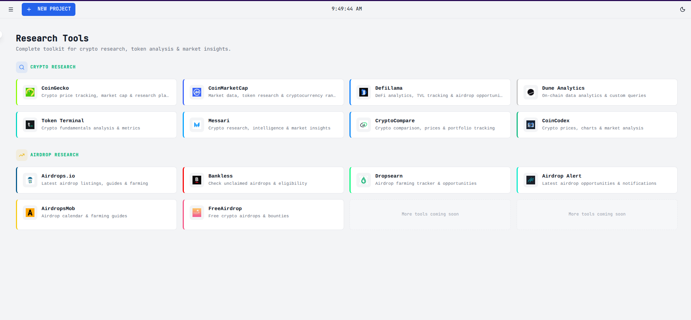

<p align="center">

</p>

<h1 align="center">🚀 Alpha Tracker</h1>

<p align="center">
A productivity dashboard for <b>crypto hunters, airdrop farmers, and Web3 researchers</b>.
</p>

<p align="center">


</p>

---

# 🌐 Live Demo

https://alpha-trecker.vercel.app

---

# 🖼 Preview

## Dashboard



## AI Tools



## Swap & Bridge



## Screening Tools



---

# 📊 Feature Overview


            Alpha Tracker
                  │
 ┌────────────────┼────────────────┐
 │                │                │
 Dashboard Research Tools Management
│ │ │
Projects AI Tools Hub Multi Wallet
Progress Swap & Bridge Faucet Manager
Analytics Screening Tools Ecosystem Tracker


---

# ✨ Features

## 📊 Dashboard

Track your overall airdrop and crypto activity.

- Project progress tracking
- Success rate monitoring
- Ecosystem participation
- Task management

---

## 🌍 Ecosystem Manager

Manage blockchain ecosystems and projects.

- Track ecosystem participation
- Monitor projects
- Organize opportunities

---

## 💧 Faucet Manager

Store and manage testnet faucets.

- Add faucet links
- Track faucet sources
- Organize testnet resources

---

## 🤖 AI Tools Hub

Quick access to powerful AI tools.

Included:

- ChatGPT
- Claude
- DeepSeek
- Perplexity
- Phind
- GitHub Copilot
- Codeium
- Tabnine

---

## 🔄 Swap & Bridge Tools

Access top DEXs and bridges.

DEX

- Uniswap
- SushiSwap
- PancakeSwap
- Curve
- Balancer

Aggregators

- Matcha
- ParaSwap
- OpenOcean
- LI.FI

Bridges

- Stargate
- Across
- Orbiter
- Hop
- LayerZero

---

## 🔍 Wallet Screening

Multi-chain wallet activity tools.

Supported chains:

- Ethereum
- Base
- Arbitrum
- Polygon
- BNB Chain
- Solana
- Sui

---

## 👥 Multi Account Management

Designed for **airdrop farmers managing multiple wallets**.

- Organize wallet activity
- Track participation
- Manage strategies

---

# 🛠 Tech Stack

Frontend

- React
- TypeScript
- Vite

UI

- TailwindCSS
- Shadcn UI

Backend

- Supabase

Deployment

- Vercel

---

# ⚡ Installation

Clone repository

```bash
git clone https://github.com/Rangger0/alpha-trecker.git

Enter folder

cd alpha-trecker

Install dependencies

npm install

Run development server

npm run dev

Open browser

http://localhost:5173
📦 Build

Build production

npm run build

Preview

npm run preview
🚀 Roadmap

Planned future features

Airdrop eligibility checker

Wallet analytics

On-chain tracking

AI research assistant

Portfolio analytics

Auto airdrop discovery

👨‍💻 Author

Rangger

GitHub
https://github.com/Rangger0

📜 License

MIT License